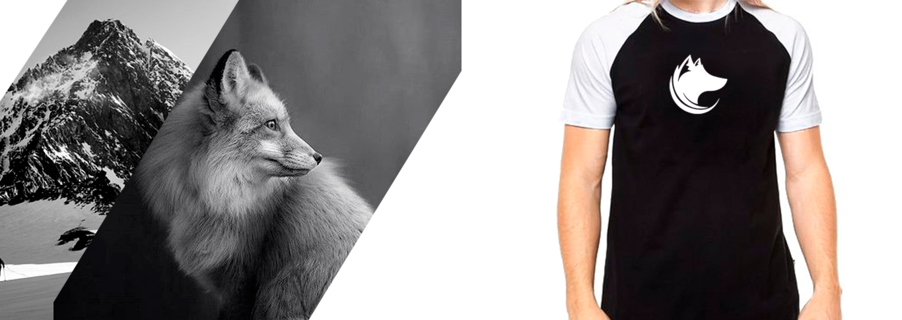
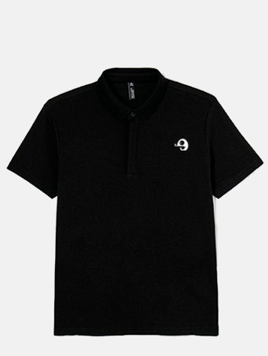
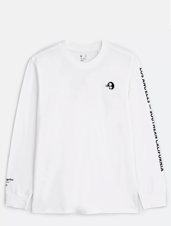
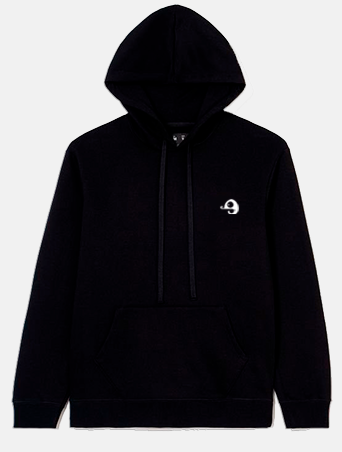

<!DOCTYPE html>
<html>
<head>	
	<title>
	Página Inicial - Your Fashion
	</title>
</head>
	<link rel="stylesheet" type="text/css" href="Style.css">
<body>
	<header id="home">
		<nav>
		 

		 	<table>
		 		<tr>
		 			<td></td>
		 			<td><a class="a-header"  href="Home.html">HOME |</a></td>
		 			<td><a class="a-header"  href="Conhecimento.html">CONHECIMENTO |</a></td>
		 			<td><a class="a-header"  href="Projetos.html">PROJETOS |</a></td>
		 			<td><a class="a-header"  href="Contato.html">CONTATO</a></td>
		 		</tr>
		 	</table>
	 	 

		 </nav>
	</header>

	
	<h1 align="center"><button id=button-main><a id="a-main" href="Contato.html">FAÇA SUA MARCA E ROUPAS ESTAMPADAS</a></button></h1>

	

		<h2 d="Estampas" align="center">ROUPAS ESTAMPADAS COM SUA MARCA</h2>
		

	

	<section id="II-Grid">
			
Sua marca será estampada nas roupas do seu gosto.  Você será o <b>DESTAQUE</b>, suas roupas serão únicas.Todos associaram o seu <b>SÍMBOLO</b> a <b>VOCÊ</b>

			

				
				<button class="b-Comprar"><a id="a-button" href="Contato.html">	<b>COMPRAR</b></a></button>
			

			

				
				<button class="b-Comprar" ><a id="a-button" href="Contato.html">	<b>COMPRAR</b></a></button>
			

			

				
				<button class="b-Comprar" ><a id="a-button" href="Contato.html">	<b>COMPRAR</b></a></button>
			

	</section>

	<footer>
		
.

		

		
<button><a id="a-button" href="#home">	<b>VOLTAR AO TOPO</b></a></button>

		

			<h6>
				<a class="a-footer" href="https://www.facebook.com/people/Deivid-Hugo/100006073369115">Facebook |</a>
				<a class="a-footer" href="https://www.instagram.com/d.eivi.d">Instagram |</a> 
				<a class="a-footer" href="https://twitter.com/Deividhug">Twitter</a>
			</h6>
		

		<h6 align="center" id="h6-footer"> Todos os direitos reservados - Deivid Hugo 202022731<h6>
	</footer>

</body>
</html>
